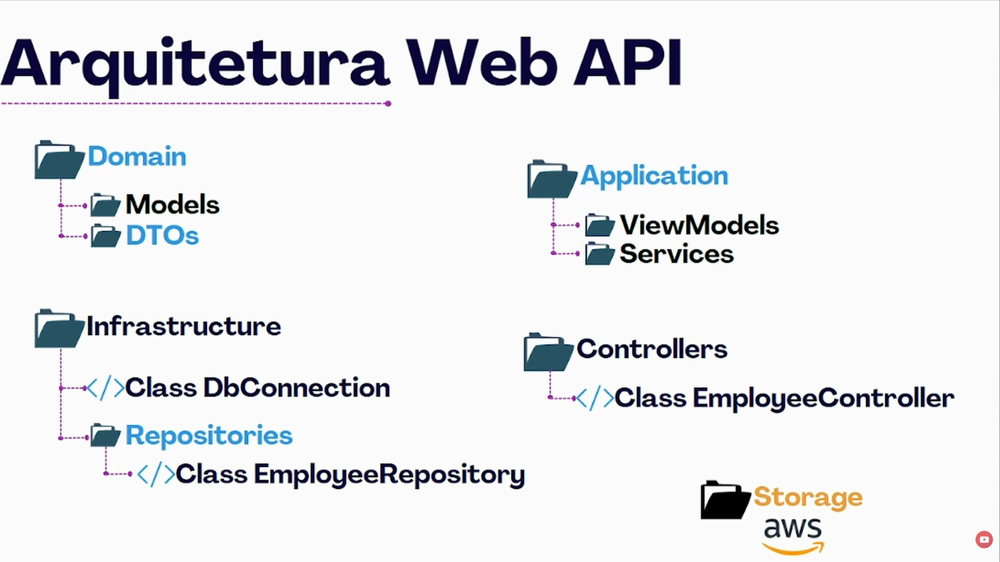

# Diário de Estudos — Web API com .NET

## Contexto

Aprendendo a criar 1 API no momento, base construida com .net 10 e banco de dados postgres rodando no docker.

Instalei 2 pacotes nuget, npgsql e o entity framework

---

## Estruturando as pastas

### Model

- Tem que ser montada desse jeito
- Colocar o Table para quando o nome da classe for diferente do nome da tabela no banco, criar as propriedades com o mesmo nome.
- Key é para definir a chave primária

```csharp
{
    [Table("employee")]
    public class Employee
    {
        [Key]
        public int id { get; private set; }
        public string name { get; private set; }
        public int age { get; private set; }
        public string photo { get; private set; }

    }
}
```

### Interface - Repository

- Fiz a classe para poder Adicionar e Obter funcionários

### Infraestrutura

- Classe ConnectionContext, para mapear a conexão do banco
- Dbset mapeia, procura a tabela no banco e compara com a classe

```csharp
namespace PrimeiraApi.Infraestrutura
{
    public class ConnectionContext : DbContext
    {
        public DbSet<Employee> Employees { get; set; }
    }
}
```

- Configuração da conexão com o banco

```csharp
protected override void OnConfiguring(DbContextOptionsBuilder optionsBuilder)
    => optionsBuilder.UseNpgsql(
        "Server=localhost;" +
        "Port=3305;Database=postgres;" +
        "User Id=postgres;" +
        "Password=password"
    );
```

---

## Injeção de dependencia

É preciso definir issso no program

```csharp
builder.Services.AddTransient<IEmployeeRepository, EmployeeRepository>();
```

---

## ViewModel

Criei 1 pasta chamado ViewModel, será ela que vou passar no controller para alimentar e passar na employeRepository

---

## Envio de arquivos

Para enviar arquivos, passar o `[FromForm]`, utilizar `IFormFile` e `Path.Combine` para salvar o caminho do arquivo e não em si salvar o arquivo ou converter ele, pegaremos ele, colocar num storage e salvar esse caminho, pequeno exemplo no Controller de como fazer para a API copiar o file para o storage

```csharp
var filePath = Path.Combine("Storage", employeeView.Photo.FileName);
using Stream fileStream = new FileStream(filePath, FileMode.Create);
employeeView.Photo.CopyTo(fileStream);
```

---

## Rota de download

Criado a rota de download da foto por ID, hoje o que utilizo é BO e DAO, então estou entendendo um pouco de como devo fazer e onde passar cada parametro para conseguir 1 resultado

Pelo que entendi também, o EntityFramework utiliza LINQ, não é necessario fazer ou injetar códigos SQL no código

---

## Segurança com JWT

Trabalhando com segurança agora na API, usaremos JWT, injetar 1 token de acesso

- Instalando o pacote `Microsoft.IdentityModel.Tokens` e `System.IdentityModel.Tokens.Jwt`

### TokenService

- Criei a pasta Services e 1 classe TokenService, vai ser a responsavel por gerar o token
- No tokenService fez algo que faz como coletar o ID do funcionario durante o codigo pelo token
- Essa classe gera o token e return ele

```csharp
    public class TokenService
    {
        public static object GenerateToken(Employee employee)
        { 
            var key = Encoding.ASCII.GetBytes(Key.Secret);
            var tokenConfig = new SecurityTokenDescriptor
            {
                Subject = new System.Security.Claims.ClaimsIdentity(new Claim[]
                {
                    new Claim("employeeId", employee.id.ToString()),
                }),
                Expires = DateTime.UtcNow.AddHours(3),
                SigningCredentials = new SigningCredentials(new SymmetricSecurityKey(key), SecurityAlgorithms.HmacSha256Signature)
            };

            var tokenHandler = new JwtSecurityTokenHandler();
            var token = tokenHandler.CreateToken(tokenConfig);
            var tokenString = tokenHandler.WriteToken(token);

            return new
            {
                token = tokenString
            };
        }

    }
}
```

### Validação do token

- Um metodo no program para essa validação

```csharp
builder.Services.AddSwaggerGen(c =>
{
    c.AddSecurityDefinition("Bearer", new OpenApiSecurityScheme
    {
        Name = "Authorization",
        In = ParameterLocation.Header,
        Type = SecuritySchemeType.Http,
        Scheme = "bearer",
        BearerFormat = "JWT"
    });

    c.AddSecurityRequirement(document =>
        new OpenApiSecurityRequirement
        {
            [new OpenApiSecuritySchemeReference("Bearer", document)] = new List<string>()
        });
});
```

---

## Arquitetura Web API


