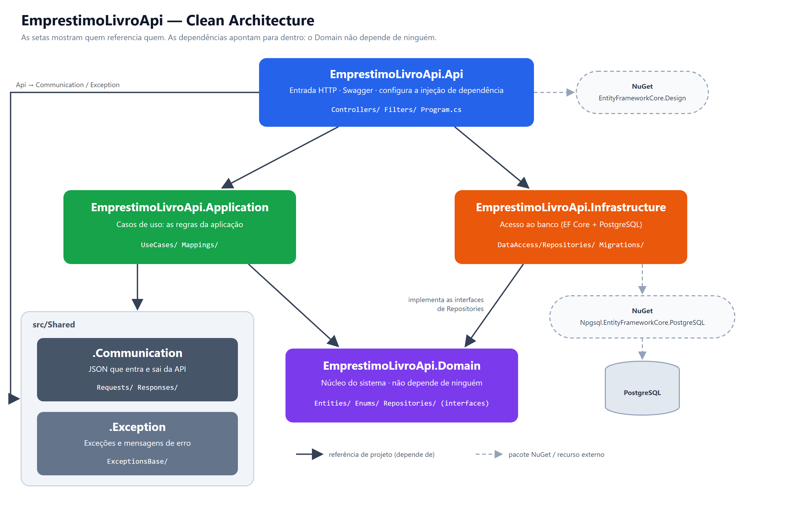

# Diário de Estudos — EmprestimoLivroApi

> Projeto: `EmprestimoLivroApi` · .NET 10 · PostgreSQL · Entity Framework · Clean Architecture

## Sumário

1. [Contexto](#contexto)
2. [Swagger](#swagger)
3. [Clean Architecture](#clean-architecture)
4. [Camadas e pastas](#camadas-e-pastas)
5. [Relação entre os projetos](#relação-entre-os-projetos)
6. [Entity Framework com PostgreSQL](#entity-framework-com-postgresql)
7. [A estudar](#a-estudar)

---

## Contexto

API de empréstimo de livros, criada para usar como base de estudo. A estrutura segue a mesma arquitetura do projeto [MyRecipeBook](https://github.com/welissonArley/MyRecipeBook).

Nesse primeiro momento foram criados somente os projetos e as pastas, sem nenhuma classe.

---

## Swagger

- O .NET 10 já gera a especificação da API sozinho com o `AddOpenApi()` / `MapOpenApi()`
- Instalei só a tela do Swagger (`Swashbuckle.AspNetCore.SwaggerUI`), apontando para `/openapi/v1.json`
- No `launchSettings.json` coloquei `launchUrl: "swagger"`, então ao rodar a API o navegador já abre no Swagger

---

## Clean Architecture

Foi feita a **Clean Architecture**, criada pelo Robert C. Martin (Uncle Bob).

- O sistema é dividido em camadas, cada uma em um projeto separado
- A regra principal: **as dependências apontam para dentro**. O `Domain` é o centro e não depende de ninguém
- Cada ação do sistema vira um **Use Case** (ex: `RegistrarLivroUseCase`), em vez de ficar tudo no controller
- O controller só recebe a requisição e chama o use case
- A `Infrastructure` implementa as interfaces que o `Domain` define (ex: repositórios). Assim dá para trocar o banco sem mexer na regra de negócio



---

## Camadas e pastas

```
EmprestimoLivroApi.slnx
src/
├── Backend/
│   ├── EmprestimoLivroApi.Api              → Controllers/  Filters/
│   ├── EmprestimoLivroApi.Application      → UseCases/  Mappings/
│   ├── EmprestimoLivroApi.Domain           → Entities/  Enums/  Repositories/
│   └── EmprestimoLivroApi.Infrastructure   → DataAccess/Repositories/  Migrations/
└── Shared/
    ├── EmprestimoLivroApi.Communication    → Requests/  Responses/
    └── EmprestimoLivroApi.Exception        → ExceptionsBase/
```

| Projeto                  | Para que serve                                                                                                        |
| ------------------------ | --------------------------------------------------------------------------------------------------------------------- |
| **Api**            | Porta de entrada HTTP: controllers, filtros, Swagger e o`Program.cs` que registra tudo na injeção de dependência |
| **Application**    | Os casos de uso (regras da aplicação) e o mapeamento entre entidades e JSON                                         |
| **Domain**         | O núcleo: entidades, enums e as**interfaces** dos repositórios                                                |
| **Infrastructure** | Acesso ao banco:`DbContext`, implementação dos repositórios e migrations                                         |
| **Communication**  | As classes do JSON que entra (`Requests`) e que sai (`Responses`) da API                                          |
| **Exception**      | Exceções do sistema e mensagens de erro                                                                             |

- Pastas vazias têm um `.gitkeep` para o git não ignorar. Pode apagar quando colocar o primeiro arquivo nela

---

## Relação entre os projetos

| Projeto        | Referencia                                            |
| -------------- | ----------------------------------------------------- |
| Api            | Application, Infrastructure, Communication, Exception |
| Application    | Domain, Communication, Exception                      |
| Infrastructure | Domain                                                |
| Domain         | ninguém                                              |
| Communication  | ninguém                                              |
| Exception      | ninguém                                              |

- A `Api` é a única que conhece todo mundo, porque é ela que liga as camadas na injeção de dependência
- A `Application` não conhece a `Infrastructure`: ela usa as interfaces do `Domain`, e quem entrega a implementação é a injeção de dependência

---

## Entity Framework com PostgreSQL

Pacotes instalados:

- `Npgsql.EntityFrameworkCore.PostgreSQL` (10.0.3) na **Infrastructure** — já traz o Entity Framework Core junto
- `Microsoft.EntityFrameworkCore.Design` (10.0.12) na **Api** — necessário para o `dotnet ef` gerar as migrations

Como o `DbContext` fica na Infrastructure e o `Program.cs` na Api, o comando de migration precisa apontar os dois projetos:

```bash
dotnet ef migrations add Inicial --project src/Backend/EmprestimoLivroApi.Infrastructure --startup-project src/Backend/EmprestimoLivroApi.Api
```

- Eu
- Criei a classe Livros e vou criar a Classe de Autor com uma lista de livros
- Criado as 2 entitites também de Reader e Loan
- Conectando todos para na hora que gferar a migration com FK já

---

## A estudar

- [ ] Estudar injeção de dependencia
