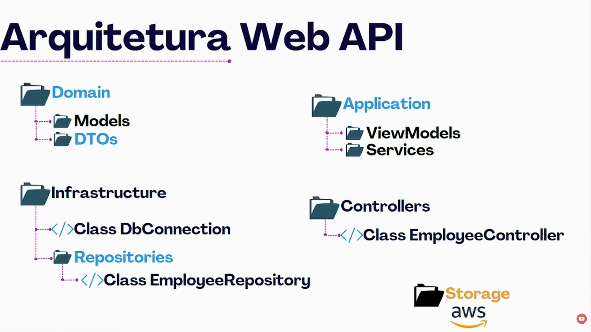

# PrimeiraApi — Web API de Funcionários

[← Voltar para os estudos](../README.md)

Minha primeira Web API completa em .NET: cadastro de funcionários com foto, login com JWT e um front-end em Vue para consumir a API.

## Stack

**Back-end:** .NET 10 · C# · ASP.NET Core Web API · Entity Framework Core · PostgreSQL (Docker) · JWT · AutoMapper · Swagger

**Front-end:** Vue 3 · Quasar · Axios

## O que a API faz

- Cadastro de funcionário com upload de foto
- Listagem paginada de funcionários
- Busca de funcionário por ID
- Download da foto do funcionário
- Login com geração de token JWT e rotas protegidas com `[Authorize]`
- Versionamento da API (`v1` e `v2`) com Swagger separado por versão
- Banco criado e atualizado via Migrations do Entity Framework
- Tratamento de erros com `ProblemDetails`
- CORS liberado para o front-end

## Como rodar

**Pré-requisitos:** .NET 10 SDK, Docker e Node.js

Os comandos partem da pasta `WebApi`.

**1. Subir o PostgreSQL no Docker**

```bash
docker run --name postgres -e POSTGRES_PASSWORD=password -p 3305:5432 -d postgres
```

**2. Criar as tabelas com as migrations**

```bash
cd PrimeiraApi
dotnet tool install --global dotnet-ef   # só na primeira vez
dotnet ef database update
```

**3. Rodar a API**

```bash
dotnet run --launch-profile https
```

A API sobe em `https://localhost:7267` e o Swagger fica em `https://localhost:7267/swagger`.

**4. Rodar o front-end**

```bash
cd ../primeira-api-vue-js
npm install
npm run serve
```

O front abre em `http://localhost:8080`.

## Estrutura



```
WebApi/
├── PrimeiraApi/
│   ├── Application/      # Mapping (AutoMapper), Services (TokenService), ViewModel, Swagger
│   ├── Controllers/      # v1, v2, Auth e tratamento de erros
│   ├── Domain/           # Models (Employee, Company) e DTOs
│   ├── Infraestrutura/   # ConnectionContext (DbContext) e Repositories
│   ├── Migrations/       # Migrations do Entity Framework
│   └── Storage/          # Fotos dos funcionários
└── primeira-api-vue-js/  # Front-end em Vue + Quasar
```

## Diário de estudos

Minhas anotações de cada etapa, do primeiro Model até JWT, AutoMapper e Migrations, estão no [DIARIO.md](DIARIO.md).
